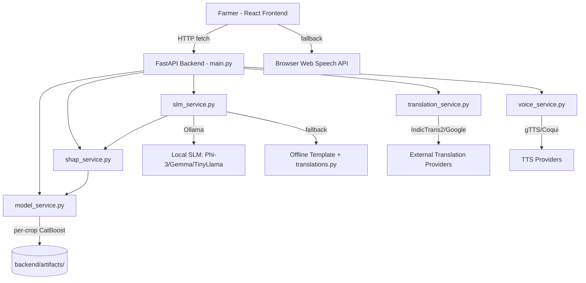
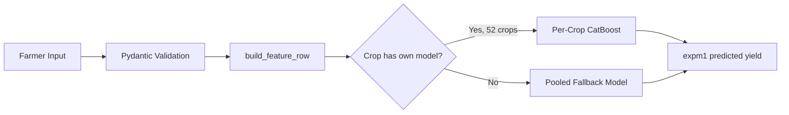
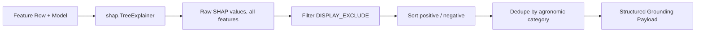
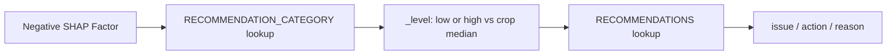
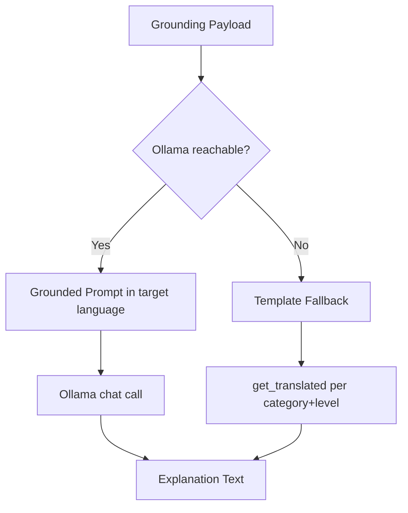
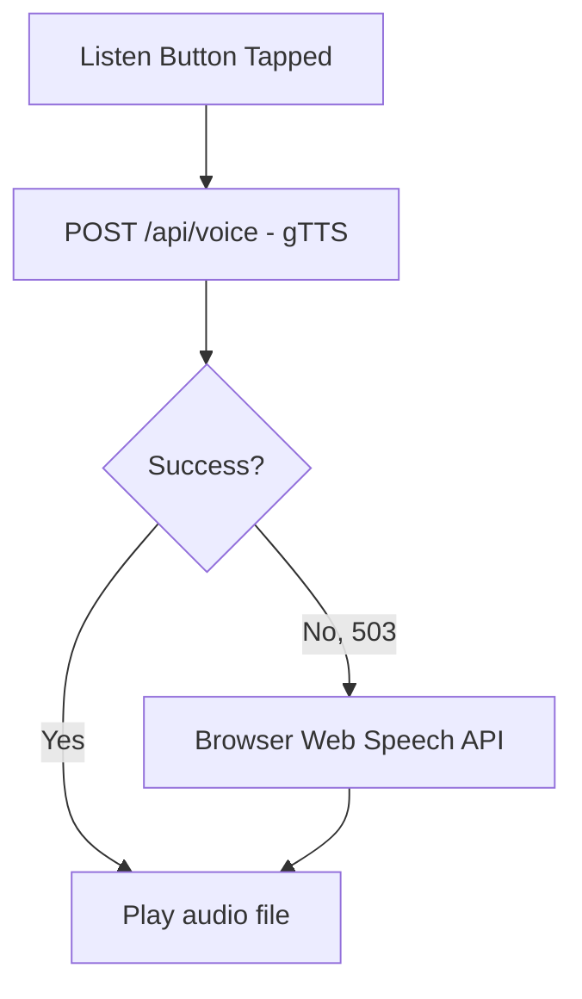
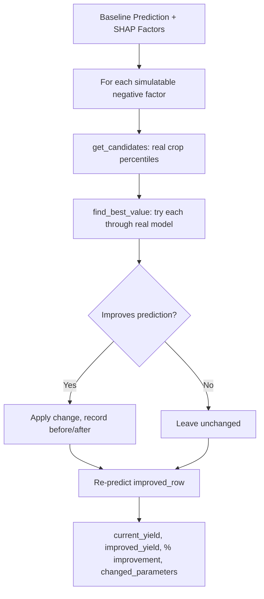
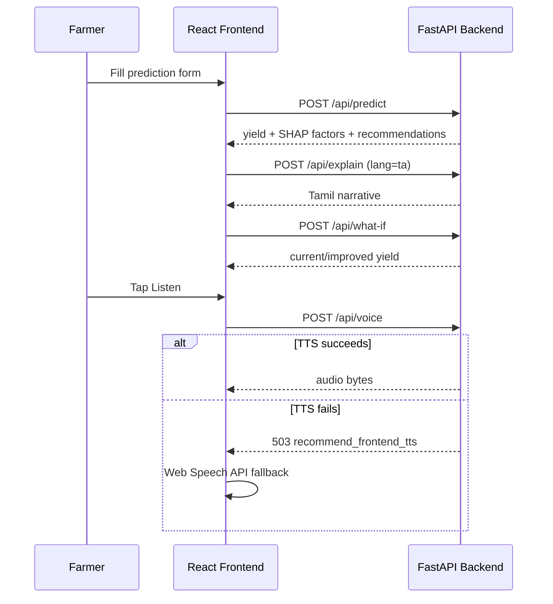
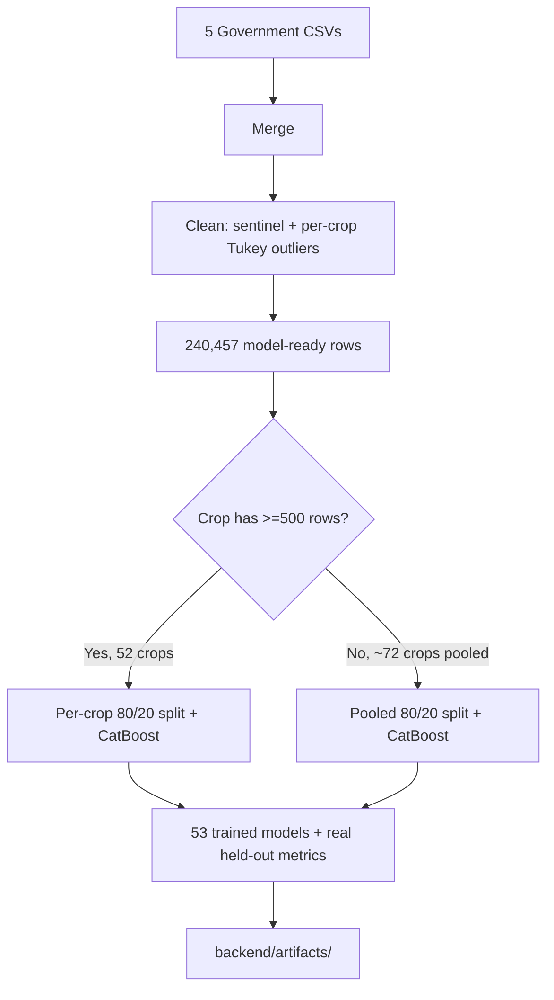

# Project Diagrams

## 1. System Architecture

## 2. Prediction Pipeline

## 3. Explainability Pipeline

## 4. Decision Support Pipeline

## 5. SLM + Multilingual Explanation Pipeline

## 6. Voice Assistant Pipeline

## 7. What-If Simulation Pipeline

## 8. Frontend-Backend Communication

## 9. Model Training Workflow

